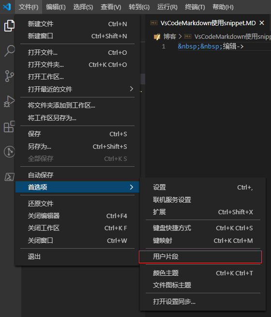

&nbsp;&nbsp;**文件->首选项->用户片段**


&nbsp;&nbsp;输入markdown


&nbsp;&nbsp;输入代码片段


`Ctrl+P`，输入**settings.json**

加入下面个这个选项

```json
    "[markdown]": {
        "editor.wordWrap": "on",
        "editor.quickSuggestions": true
    },
````